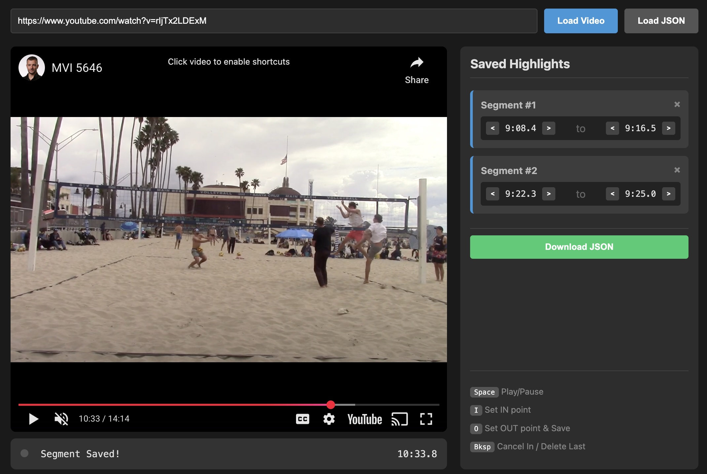

# YouTube Highlight Creator

A simple, efficient tool to create highlight reels from YouTube videos.

This project consists of two parts:
1. **Web Editor (`video-editor.html`):** A browser-based interface to select segments of interest in YouTube videos. It allows to mark and adjust "In" and "Out" points, and export the timestamps as JSON.
2. **Python Processor (`create_highlight_video.py`):** A script that takes those JSON files, downloads *only* the specific segments (saving bandwidth), and merges them into a single video file.



## 🚀 Workflow

The process is designed to be fast and non-destructive.

1.  **Open the Editor:** Launch `video-editor.html` in your browser.
2.  **Mark Segments:** Load a YouTube URL. Use keyboard shortcuts to mark the start (`I`) and end (`O`) of plays/actions.
3.  **Refine:** Use the on-screen "Nudge" buttons to adjust the timing by 0.5s if you missed the exact frame.
4.  **Export:** Click "Download JSON" to save your work.
5.  **Process:** Point the Python script at the folder containing your JSON files. It will automatically download and stitch the video.
6.  **Save Progress/Continue**: You can save a JSON file and resume/edit later with the `Load JSON` button.

## 🛠️ Prerequisites

To run the processing script, you need:

1.  **Python 3.x**
2.  **FFmpeg** (Must be installed and added to your system PATH).
    * *Mac:* `brew install ffmpeg`
    * *Windows:* [Download and install guide](https://ffmpeg.org/download.html)
3.  **yt-dlp** library.
    * `pip install yt-dlp`

## 🎮 Web Editor Guide

### Running the Editor
For the best experience (and to avoid YouTube API restrictions), it is recommended to run the HTML file via a local server rather than double-clicking it.

```bash
# Run inside the folder containing video-editor.html
python3 -m http.server 8000
```
Then open `http://localhost:8000/video-editor.html` in your browser.

### Keyboard Shortcuts
| Key | Action |
| :--- | :--- |
| **Space** | Play / Pause |
| **I** | Mark **IN** point (Start of highlight) |
| **O** | Mark **OUT** point (End of highlight) |
| **Backspace** | Cancel current recording OR Delete last saved clip |
| **Left / Right Arrow** | Seek backward/forward 5 seconds |

## 🎞️ Generating the Video

Once you have one or more JSON files exported from the web tool:

1.  Place your JSON files in a folder (e.g., `Season_Highlights`).
2.  Run the script pointing to that folder:

```bash
python create_highlight_video.py "path/to/Season_Highlights"
```

If you don't provide a path, it looks in the current directory.

### Tip: Ordering Your Matches
The script processes videos in **alphabetical order**. To ensure your season highlights play in chronological order, name your JSON files starting with the date:

* `2023-09-15_vs_Titans.json`
* `2023-09-22_vs_Giants.json`
* `2023-10-05_Playoffs.json`

## ⚠️ Troubleshooting

**"Video Unavailable" / Error 150/153 in Editor:**
The video owner has disabled embedding. You cannot edit these videos using the web interface.

**FFmpeg Error during processing:**
If the final video doesn't generate, the script automatically attempts a "Re-encode" fallback. This takes longer but fixes issues where source videos have different resolutions (e.g., mixing 720p and 1080p footage).